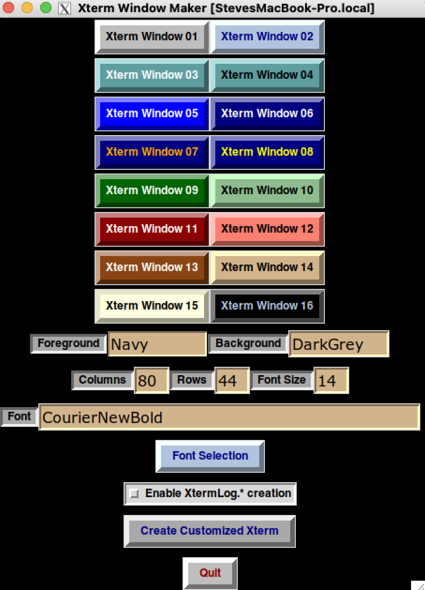
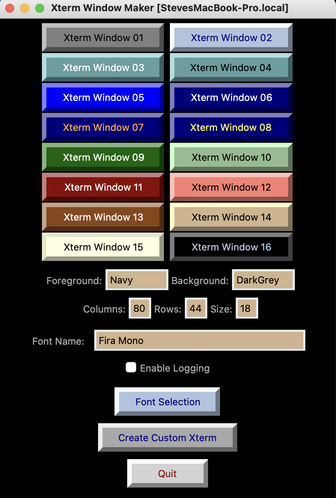

# Project xt
This repository for GitHub Project xt, contains programs to launch dashboards will enable rapid xterm window generation using the users' preferences.

Perl script, xt.pl can be executed directly or it may be launched vi xt.ksh, a ksh script to set the environment and launch xt.pl. ~/bin/xt is a symbolic link to ~/xt.ksh.

Python script, xt.py can be executed directly or it may be launched vi xtpy, a ksh script to set the environment and launch xt.pl.

Set up scripts will simply the installation of this repositories components to
the users' servers.

Perl xt.pl:

Python xt.py:

